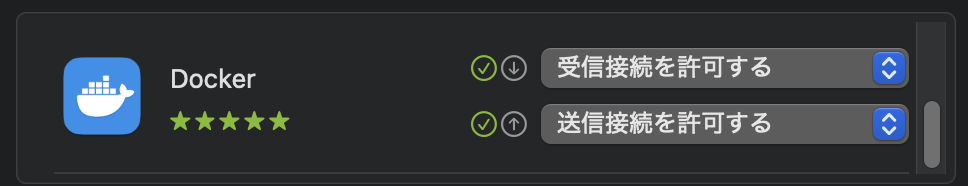
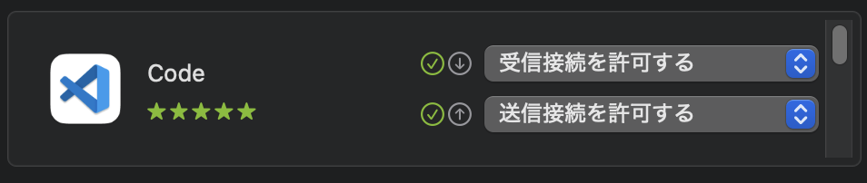

# Dev Containers 設定 - VSCode

## Troubleshooting

### macOS では TCP port=5000 に接続できない

macOS Sequoia 15.1.1 で使用されているようです。
他を当たりましょう。

```shell
lsof -i:5000
```

```console
COMMAND   PID  USER   FD   TYPE             DEVICE SIZE/OFF NODE NAME
ControlCe 591 akira   10u  IPv4 0xdf59e5f5ee938f1d      0t0  TCP *:commplex-main (LISTEN)
ControlCe 591 akira   11u  IPv6 0x86f831f7b79a8621      0t0  TCP *:commplex-main (LISTEN)
```

### Empty reply from server before connecting to nginx

```shell
curl http://localhost:80
```

```console
curl: (52) Empty reply from server
```

SSLでは別のエラーになる

```shell
curl https://localhost:443 
```

```console
curl: (35) Recv failure: Connection reset by peer
```

ESET Cyber security を使用している場合ファイアーウォールに阻まれまれるようです。  
アプリケーションルールへ Docker.app を追加する必要があるようです。

設定 > ファイアーウォール > アプリケーションルール

<!-- markdownlint-disable-next-line MD033 -->


### Empty reply from server before connecting to Flask (app server?)

```shell
curl -v http://localhost:5001
```

```console
 ...
* Trying [::1]:5001...
* connect to ::1 port 5001 from ::1 port 54675 failed: Connection refused
* Trying 127.0.0.1:5001...
* Connected to localhost (127.0.0.1) port 5001
 ...

curl: (52) Empty reply from server
```

こんどは ESET Cyber security のアプリケーションルールへ Code.app を追加する必要があるようです。

設定 > ファイアーウォール > アプリケーションルール

<!-- markdownlint-disable-next-line MD033 -->

